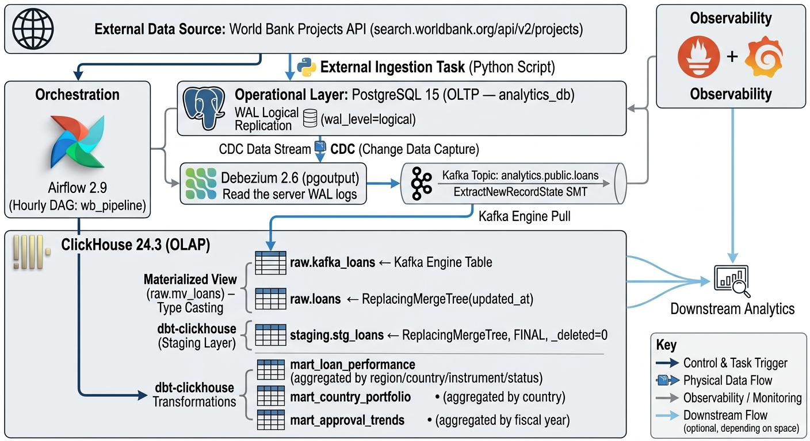

# Design Report — World Bank Loans Analytics Pipeline

## 1. Architecture Overview



```
┌─────────────────────────────────────────────────────────────────────────┐
│                         INGESTION LAYER                                 |
│                                                                         |
│   World Bank Projects API  ──►  Python ingest.py  ──►  PostgreSQL 15    │
│   (search.worldbank.org)         (batched upsert)      (analytics_db)   │
│        No auth required          500 rows/batch                         |
└──────────────────────────────────┬──────────────────────────────────────┘
                                   │  WAL logical replication
                                   │  (wal_level = logical)
                                   ▼
┌─────────────────────────────────────────────────────────────────────────┐
│                            CDC LAYER                                    |
│                                                                         |
│   Debezium 2.6  ──►  Kafka topic: analytics.public.loans                │
│   (pgoutput)         ExtractNewRecordState transform                    |
│                       __op, __ts_ms, __deleted fields added             │
└──────────────────────────────────┬──────────────────────────────────────┘
                                   │  Kafka engine pull
                                   ▼
┌─────────────────────────────────────────────────────────────────────────┐
│                          OLAP LAYER (ClickHouse)                        │
│                                                                         |
│  raw.kafka_loans (Kafka engine)                                         |
│       │                                                                 |
│       ▼ (Materialized View: raw.mv_loans)                               |
│  raw.loans (ReplacingMergeTree)                                         |
│       │                                                                 |
│       ▼ (dbt — staging layer)                                           |
│  staging.stg_loans (ReplacingMergeTree)                                 |
│       │                                                                 |
│       ▼ (dbt — mart layer)                                              |
│  mart.mart_loan_performance   (ReplacingMergeTree)                      |
│  mart.mart_country_portfolio  (ReplacingMergeTree)                      |
│  mart.mart_approval_trends    (SummingMergeTree)                        |
└─────────────────────────────────────────────────────────────────────────┘
                                   │
┌──────────────────────────────────▼──────────────────────────────────────┐
│                         ORCHESTRATION LAYER                             |
│                                                                         |
│   Airflow (hourly DAG: wb_pipeline)                                     |
│   ingest → wait 30s → dbt deps → dbt run staging → dbt test staging     │
│         → dbt run mart → dbt test mart → push Prometheus metric         |
└─────────────────────────────────────────────────────────────────────────┘
                                   │
┌──────────────────────────────────▼──────────────────────────────────────┐
│                        OBSERVABILITY LAYER                              |
│                                                                         |
│   Prometheus  ◄──  ClickHouse metrics (port 9363)                       |
│               ◄──  Pushgateway (pipeline health, ingestion counts)      |
│                                                                         |
│   Grafana  ◄──  Prometheus datasource                                   |
│            Panels: pipeline status, loans ingested, run duration,       |
│                    errors, ClickHouse insert rate, query duration       |
└─────────────────────────────────────────────────────────────────────────┘
```

---

## 2. Data Flow Explanation

### Step 1 — Ingestion (REST API → PostgreSQL)

`ingestion/ingest.py` polls the [World Bank Projects API](https://search.worldbank.org/api/v2/projects) — a public endpoint requiring no authentication. It fetches up to 10,000 records in paginated batches of 500, parsing each project into a typed Python dict and performing a bulk upsert into PostgreSQL using `psycopg2.extras.execute_values` with `ON CONFLICT (project_id) DO UPDATE SET`. Only mutable fields (status, commitment amounts, closing date, updated_at) are overwritten on conflict; dimension fields set at project creation are preserved.

Retry logic applies exponential backoff `(1s → 3s → 9s)` for transient network and 5xx errors. 4xx client errors are not retried. A Prometheus Pushgateway metric is emitted at the end of each run capturing records ingested, run duration, and error count.

### Step 2 — Change Data Capture (PostgreSQL → Kafka)

PostgreSQL is configured with `wal_level = logical`. A logical replication publication (`dbz_publication`) is created for the `loans` table. Debezium 2.6 reads the WAL via the `pgoutput` plugin and publishes change events to the Kafka topic `analytics.public.loans`.

The `ExtractNewRecordState` Single Message Transform (SMT) unwraps Debezium's nested envelope, adding `__op` (operation type: c/u/d/r), `__ts_ms` (source event timestamp), and `__deleted` (soft-delete flag) to each flattened record. Tombstone records are forwarded rather than dropped, with `delete.handling.mode: rewrite` writing a final record with `__deleted = true` before the tombstone, giving ClickHouse a clean delete signal.

### Step 3 — Raw Landing (Kafka → ClickHouse)

ClickHouse consumes from Kafka using the built-in Kafka table engine (`raw.kafka_loans`). A Materialized View (`raw.mv_loans`) fires on every batch consumed by the engine, casting all string-typed Kafka fields to their target types using `toDecimal64OrNull`, `toDateOrNull`, `toInt16OrNull`, and `parseDateTime64BestEffortOrZero` — functions that return `NULL` on parse failure rather than raising an error. The typed rows are inserted into `raw.loans` (`ReplacingMergeTree`).

### Step 4 — Staging Transformation (dbt)

`staging.stg_loans` reads from `raw.loans FINAL` (forcing on-read deduplication) and filters `_deleted = 0` to exclude soft-deleted rows. It applies `ifNull` coalescing to replace nulls with domain-appropriate defaults (empty string for text, `0` for amounts, `1970-01-01` for dates), normalizes `status` to lowercase and `country_code` to uppercase, and eliminates records with a blank `project_id`.

### Step 5 — Mart Modeling (dbt)

Three mart tables are materialized from `stg_loans`:

| Model | Grain | Purpose |
|---|---|---|
| `mart_loan_performance` | region × country × instrument × status | Portfolio composition and status breakdown per segment |
| `mart_country_portfolio` | region × country | Aggregate commitment totals, active vs. closed project counts per country |
| `mart_approval_trends` | approval year × region × instrument | Year-over-year lending trend analysis by instrument type |

### Step 6 — Orchestration

The Airflow DAG `wb_pipeline` runs hourly and executes steps sequentially with a 30-second sensor pause after ingestion to allow CDC events to propagate through Kafka into ClickHouse before dbt reads. dbt stages and mart layers are tested independently; a failed `dbt test` halts the downstream mart run. A `push_success_metric` task posts a binary health gauge to the Pushgateway on successful completion.

---

## 3. Data Model & Schema Documentation

### 3.1 PostgreSQL — OLTP Source

**Table: `public.loans`**

| Column | Type | Notes |
|---|---|---|
| `project_id` | `VARCHAR(20)` | Primary key — World Bank project ID (e.g. `P123456`) |
| `project_name` | `VARCHAR(500)` | Full project title |
| `country` | `VARCHAR(200)` | Country name |
| `country_code` | `CHAR(2)` | ISO 2-letter code |
| `region` | `VARCHAR(100)` | World Bank region grouping |
| `status` | `VARCHAR(50)` | `Active`, `Closed`, `Pipeline`, etc. |
| `lending_instrument` | `VARCHAR(150)` | `Investment Project Financing`, `DPL`, etc. |
| `total_commitment_usd` | `DECIMAL(20,2)` | Total World Bank commitment in USD |
| `ibrd_commitment_usd` | `DECIMAL(20,2)` | IBRD portion |
| `ida_commitment_usd` | `DECIMAL(20,2)` | IDA portion |
| `total_project_cost_usd` | `DECIMAL(20,2)` | Total project cost including co-financing |
| `board_approval_date` | `DATE` | Date approved by the World Bank board |
| `closing_date` | `DATE` | Projected or actual closing date |
| `approval_fy` | `SMALLINT` | World Bank fiscal year of approval |
| `source` | `VARCHAR(20)` | Source system identifier |
| `created_at` | `TIMESTAMPTZ` | Row creation timestamp |
| `updated_at` | `TIMESTAMPTZ` | Last modification timestamp |

A logical replication publication `dbz_publication FOR TABLE loans` is created at init time, enabling Debezium to read WAL events without additional configuration.

---

### 3.2 ClickHouse — Raw Layer

**`raw.kafka_loans`** — Kafka engine table (all columns `String` or `Int64`)

Acts as the ClickHouse-side consumer of the `analytics.public.loans` topic. All fields are strings because Kafka JSON payloads carry no schema; type conversion happens in the Materialized View.

**`raw.loans`** — `ReplacingMergeTree(updated_at)`

| Column | ClickHouse Type | Source |
|---|---|---|
| `project_id` | `String` | PK, ORDER BY |
| `project_name` | `String` | |
| `country` | `String` | |
| `country_code` | `String` | |
| `region` | `String` | |
| `status` | `String` | |
| `lending_instrument` | `String` | |
| `total_commitment_usd` | `Nullable(Decimal(20,2))` | |
| `ibrd_commitment_usd` | `Nullable(Decimal(20,2))` | |
| `ida_commitment_usd` | `Nullable(Decimal(20,2))` | |
| `total_project_cost_usd` | `Nullable(Decimal(20,2))` | |
| `board_approval_date` | `Nullable(Date)` | |
| `closing_date` | `Nullable(Date)` | |
| `approval_fy` | `Nullable(Int16)` | |
| `source` | `String` | |
| `created_at` | `DateTime` | |
| `updated_at` | `DateTime` | Version column for ReplacingMergeTree |
| `_deleted` | `UInt8` | 0 = live, 1 = soft-deleted |
| `_ingested_at` | `DateTime` | ClickHouse arrival time |

**`raw.mv_loans`** — Materialized View, fires on every Kafka batch, writes into `raw.loans`

---

### 3.3 ClickHouse — Staging Layer

**`staging.stg_loans`** — `ReplacingMergeTree(updated_at)`

```
ENGINE  = ReplacingMergeTree(updated_at)
ORDER BY  project_id
PARTITION BY  toYear(board_approval_date)
```

Differences from `raw.loans`:
- All nullable columns resolved to non-null defaults (`ifNull`)
- `status` lowercased, `country_code` uppercased
- Rows with blank `project_id` or `_deleted = 1` excluded
- Queried with `FINAL` to force deduplication

---

### 3.4 ClickHouse — Mart Layer

**`mart.mart_loan_performance`**

```
ENGINE  = ReplacingMergeTree(computed_at)
ORDER BY  (region, country_code, lending_instrument, status)
PARTITION BY  region
```

| Column | Type | Description |
|---|---|---|
| `region` | String | World Bank region |
| `country_code` | String | ISO 2-letter code |
| `country` | String | Country name |
| `lending_instrument` | String | Instrument type |
| `source` | String | Source system |
| `status` | String | Loan status |
| `project_count` | UInt64 | Number of projects in this segment |
| `sum_commitment_usd` | Decimal | Total commitment |
| `avg_commitment_usd` | Decimal | Average commitment |
| `sum_ibrd_usd` | Decimal | IBRD total |
| `sum_ida_usd` | Decimal | IDA total |
| `sum_project_cost_usd` | Decimal | Total project cost |
| `active_count` | UInt64 | Active projects in segment |
| `closed_count` | UInt64 | Closed projects in segment |
| `computed_at` | DateTime | Version column |

---

**`mart.mart_country_portfolio`**

```
ENGINE  = ReplacingMergeTree(computed_at)
ORDER BY  (region, country_code)
```

Provides a country-level rollup: total projects, commitment sums split by IBRD/IDA, active vs. closed counts, and earliest/latest approval dates. Useful for geographic portfolio dashboards and country-level risk analysis.

---

**`mart.mart_approval_trends`**

```
ENGINE  = SummingMergeTree()
ORDER BY  (approval_year, region, lending_instrument)
```

Aggregates annual lending volume by World Bank fiscal year, region, and instrument type. `SummingMergeTree` is used here because the aggregation is purely additive — new data for the same year/region/instrument should be summed, not replaced.

---

### 3.5 Schema Diagram (ERD)

```
PostgreSQL                    ClickHouse
──────────                    ──────────
public.loans                  raw.kafka_loans  (Kafka engine — all String)
 ├─ project_id (PK)                │
 ├─ project_name                   │ raw.mv_loans (Materialized View)
 ├─ country                        ▼
 ├─ country_code            raw.loans (ReplacingMergeTree)
 ├─ region                   ├─ project_id  (ORDER BY)
 ├─ status                   ├─ status
 ├─ lending_instrument        ├─ total_commitment_usd
 ├─ total_commitment_usd      ├─ updated_at  (version)
 ├─ ibrd_commitment_usd       ├─ _deleted
 ├─ ida_commitment_usd        └─ _ingested_at
 ├─ total_project_cost_usd           │
 ├─ board_approval_date              │ dbt (FINAL, _deleted=0)
 ├─ closing_date                     ▼
 ├─ approval_fy          staging.stg_loans (ReplacingMergeTree)
 ├─ source                ├─ project_id  (ORDER BY)
 ├─ created_at             ├─ null-coalesced typed columns
 └─ updated_at             └─ PARTITION BY toYear(board_approval_date)
                                    │
                         ┌──────────┼──────────┐
                         ▼          ▼          ▼
               mart_loan_    mart_country_  mart_approval_
               performance   portfolio      trends
               (ReplacingMT) (ReplacingMT)  (SummingMT)
```

---

## 4. ClickHouse Design Rationale

### Table Engine Selection

| Layer | Engine | Rationale |
|---|---|---|
| `raw.loans` | `ReplacingMergeTree(updated_at)` | CDC produces multiple versions of the same row (INSERT, UPDATE, soft-DELETE). `ReplacingMergeTree` deduplicates in the background using `updated_at` as the version key — the row with the highest `updated_at` wins, which maps directly to the Debezium `__ts_ms` ordering. |
| `staging.stg_loans` | `ReplacingMergeTree(updated_at)` | Same deduplication semantics as raw; queried with `FINAL` to force on-read dedup, trading query latency for correctness in a staging context. |
| `mart_loan_performance` | `ReplacingMergeTree(computed_at)` | Aggregation output changes every run; new rows replace old ones keyed by the group-by dimensions. `computed_at` is stamped at dbt run time to ensure the latest run always wins. |
| `mart_country_portfolio` | `ReplacingMergeTree(computed_at)` | Same as above. |
| `mart_approval_trends` | `SummingMergeTree()` | Annual lending volume is purely additive. Using `SummingMergeTree` lets ClickHouse merge partial aggregates in the background without requiring the query to re-aggregate at read time. |

### Partitioning Keys

| Table | Partition Key | Rationale |
|---|---|---|
| `raw.loans` | `toYear(updated_at)` | Queries filtering by year or date range prune irrelevant parts. The raw layer is write-heavy; year-level partitions keep part counts manageable for merge operations. |
| `staging.stg_loans` | `toYear(board_approval_date)` | Most analytical queries filter by approval period. Partitioning on approval year allows ClickHouse to skip entire years of data when scanning for a specific period. |
| `mart_loan_performance` | `region` | Portfolio analysis is almost always regional — partition pruning eliminates irrelevant regional data in sub-regional queries. |

### Ordering (Sorting) Keys

All `ORDER BY` keys are chosen to match the most common query filters:
- `raw.loans` and `stg_loans`: ordered by `project_id` — the primary key, supporting point lookups and deduplication.
- `mart_loan_performance`: ordered by `(region, country_code, lending_instrument, status)` — left-to-right matches dashboard filter granularity (region → country → instrument → status).
- `mart_country_portfolio`: ordered by `(region, country_code)` — supports geographic hierarchy traversal.
- `mart_approval_trends`: ordered by `(approval_year, region, lending_instrument)` — supports time-series queries first, then drilldown by geography and instrument.

### Materialized View Pattern

The Kafka engine table (`raw.kafka_loans`) and the Materialized View (`raw.mv_loans`) are separated intentionally. The Kafka engine is a pure consumer cursor — it holds no data. The MV fires synchronously on each Kafka batch consumed by the engine, casting all string fields to their target types and writing the result to `raw.loans`. This separation means:
1. Type casting failures (e.g. a malformed date) return `NULL` rather than dropping the row.
2. The raw destination table is a standard `MergeTree`, queryable at any time without special Kafka logic.
3. The ClickHouse consumer group offset is managed independently of the destination table, allowing the destination to be truncated and rebuilt without resetting the Kafka offset.

### Soft-Delete Handling

Debezium `DELETE` events are converted to records with `__deleted = true` by the `ExtractNewRecordState` SMT. The MV maps this to `_deleted = 1` in `raw.loans`. The staging model filters `WHERE _deleted = 0` and reads `FINAL`, ensuring deleted projects never appear in analytical outputs. This avoids ClickHouse `ALTER TABLE DELETE` mutations, which are asynchronous and resource-intensive.

---

## 5. Observability Design

### What Is Monitored

| Signal | Metric | Source | Purpose |
|---|---|---|---|
| Pipeline health | `pipeline_last_run_status` (0/1) | Pushgateway | Alert on DAG failure |
| Pipeline recency | `pipeline_last_run_timestamp` | Pushgateway | Detect stale runs (missed schedule) |
| Ingestion volume | `wb_loans_ingested_count` | Pushgateway | Trend analysis; catch API truncations |
| Ingestion speed | `wb_ingestion_duration_seconds` | Pushgateway | SLA tracking; detect slowdowns |
| Ingestion errors | `wb_ingestion_errors_total` | Pushgateway | Alert on repeated API failures |
| ClickHouse insert rate | `ClickHouseAsyncMetrics_*` | ClickHouse `/metrics` | Detect CDC backpressure |
| ClickHouse query duration | `ClickHouseMetrics_Query` | ClickHouse `/metrics` | Performance regression detection |
| ClickHouse memory/CPU | System metrics | ClickHouse `/metrics` | Resource saturation alerts |

### Tool Choices

**Prometheus** was chosen as the metrics store because:
- ClickHouse ships a native Prometheus endpoint on port 9363 (`prometheus: <endpoint><port>9363</port>` in `clickhouse-config.xml`) — no exporter process needed.
- The Pushgateway pattern suits batch jobs (ingestion, Airflow DAG tasks) that terminate after running and cannot be scraped on demand.
- Pull-based scraping is network-simple in a Docker Compose environment with a shared internal network.

**Grafana** was chosen as the visualization layer because:
- The `grafana-clickhouse-datasource` plugin allows direct SQL queries against ClickHouse marts, enabling data-layer dashboards (e.g. row counts, max `updated_at`) alongside infrastructure metrics.
- Dashboard-as-code via JSON provisioning files (`observability/grafana/dashboards/pipeline.json`) means dashboards are version-controlled and applied automatically on container startup.
- Prometheus and ClickHouse datasources can coexist, so infrastructure metrics (from Prometheus) and data freshness queries (from ClickHouse) live in the same dashboard.

### Grafana Dashboard (`pipeline.json`)

The provisioned dashboard contains 7 panels:

| Panel | Datasource | Query |
|---|---|---|
| Pipeline Last Run Status | Prometheus | `pipeline_last_run_status` |
| Loans Ingested (last run) | Prometheus | `wb_loans_ingested_count` |
| Ingestion Duration | Prometheus | `wb_ingestion_duration_seconds` |
| Ingestion Errors | Prometheus | `wb_ingestion_errors_total` |
| ClickHouse Insert Rate | Prometheus | ClickHouse async insert metrics |
| ClickHouse Query Duration | Prometheus | ClickHouse query metrics |
| Last Pipeline Run Timestamp | Prometheus | `pipeline_last_run_timestamp` |

---

## 6. Scalability & Extension Plan

### Current Scale

The pipeline is sized for the World Bank Projects dataset (~15,000 projects, ~50 MB). It is synchronous, single-threaded at the ingestion layer, and runs on a single Docker host.

### Scaling the Ingestion Layer

**Volume increase (10× — 150K records):** Increase `BATCH_SIZE` from 500 to 2,000 and introduce concurrent batch fetching using `concurrent.futures.ThreadPoolExecutor`. The current `time.sleep(0.3)` rate limiter would be replaced with a token-bucket throttle shared across threads. The PostgreSQL `execute_values` bulk upsert already handles large batch sizes efficiently.

**Multiple API sources:** Parameterize `ingest.py` to accept a source config (URL, field mapping, batch parameters) and run one container per source. Alternatively, replace the script with an Airbyte or Singer tap and only keep the custom ingest script as a fallback.

**Near-real-time ingestion:** If the source API supports webhooks or server-sent events, replace the polling loop with a lightweight event listener that publishes to Kafka directly, bypassing the PostgreSQL intermediate hop. The Debezium/ClickHouse layers remain unchanged.

### Scaling the CDC Layer

**Higher write throughput:** Increase Kafka partition count on the `analytics.public.loans` topic (set at topic creation time). Increase ClickHouse's Kafka consumer parallelism by adjusting `kafka_num_consumers` in the Kafka engine table DDL. Each consumer spawns an independent thread within ClickHouse.

**Multiple tables:** Add tables to `table.include.list` in the Debezium connector config and create a matching `kafka_<table>` engine table + materialized view in ClickHouse for each. The pattern is identical to the existing `loans` setup.

**Exactly-once delivery:** The current setup is at-least-once (Kafka + `ReplacingMergeTree` deduplication). For stronger guarantees, enable Kafka transactions on the producer side and use ClickHouse's `kafka_commit_every_batch = 0` with manual offset management.

### Scaling ClickHouse

**Single-node to cluster:** ClickHouse supports horizontal scaling via `ReplicatedMergeTree` (replication) and `Distributed` tables (sharding). Migrating requires changing `ENGINE = ReplacingMergeTree(...)` to `ENGINE = ReplicatedReplacingMergeTree('/clickhouse/tables/{shard}/{table}', '{replica}', ...)` and adding a `Distributed` table as the query entry point. dbt models point to the `Distributed` table, requiring no dbt model changes.

**Partitioning strategy at scale:** At 100M+ rows, switch from `toYear(updated_at)` to `toYYYYMM(updated_at)` for finer partition granularity and more efficient TTL-based data lifecycle management.

**Tiered storage:** ClickHouse supports cold storage on S3-compatible object stores (`storage_configuration` with volume policies). Archive partitions older than 2 years to S3 while keeping recent data on fast local NVMe.

### Scaling dbt Transformations

**Incremental models:** Replace `table` materializations with `incremental` (`is_incremental()` macro). Staging models would filter on `updated_at > (SELECT max(updated_at) FROM {{ this }})`, processing only changed rows per run rather than a full table scan. This reduces dbt run time from O(total rows) to O(changed rows).

**Parallel execution:** dbt's `--threads` flag controls parallelism. For a larger model graph, group models into layers with explicit dependencies and allow dbt to run independent models concurrently.

### Scaling Orchestration

**Celery executor:** Replace the LocalExecutor (current) with Airflow's CeleryExecutor backed by Redis for multi-worker task execution. Each Airflow worker runs in a separate container.

**Dynamic task generation:** Use Airflow's TaskFlow API with dynamic task mapping to parallelize ingestion across multiple API endpoints or date partitions.

**SLA enforcement:** Add `sla=timedelta(hours=2)` to critical tasks. Airflow will emit a Prometheus metric via the StatsD exporter when an SLA is missed, triggering a Grafana alert.

### Observability at Scale

**Consumer lag monitoring:** Add `danielqsj/kafka-exporter` as a sidecar service to expose `kafka_consumergroup_lag` per consumer group. This is the primary early-warning signal for CDC falling behind write throughput.

**Data freshness SLO:** Add a ClickHouse-sourced Grafana panel computing `now() - max(updated_at)` from `staging.stg_loans`. Alert if freshness exceeds 2 hours, indicating a pipeline stall that did not trigger an Airflow failure.

**Distributed tracing:** Instrument ingestion and dbt runs with OpenTelemetry spans, exporting to Tempo (Grafana's trace store). This enables correlation of slow dbt queries back to specific Kafka batch ingestion windows.
